# Automating Infrastructure using Terraform

## Excercise description:

>Nowadays, infrastructure automation is critical. We tend to put the most emphasis on software development processes, but infrastructure deployment strategy is just as important. Infrastructure automation not only aids disaster recovery, but it also facilitates testing and development.
>Your organization is adopting the DevOps methodology and in order to automate provisioning of infrastructure there's a need to setup a centralised server for Jenkins.

>Terraform is a tool that allows you to provision various infrastructure components. Ansible is a platform for managing configurations and deploying applications. It means you'll use Terraform to build a virtual machine, for example, and then use Ansible to instal the necessary applications on that machine.

>Considering the Organizational requirement you are asked to automate the infrastructure using Terraform first and install other required automation tools in it.

### Tools required: Terraform, AWS account with security credentials, Keypair

 

### Expected Deliverables:
>
> - Launch an EC2 instance using Terraform
> - Connect to the instance
> - Install Jenkins, Java and Python in the instance

***
<br>

###### **Author:** Francisco Pedraza Vázquez 

## **1. Create `AWS` credential Keys**

First we conect to AWS, and search for IAM services.

> `IAM` , or identity access management services is one of the many services provided by AWS in which we can manage perms, create users and generate key-access pairs. 

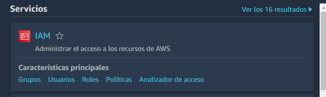
<br>

Click on Users

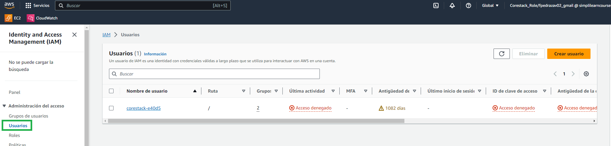
<br>
Create the new User with administrator perms

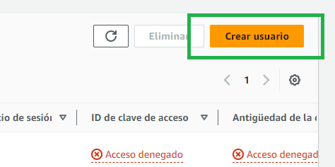
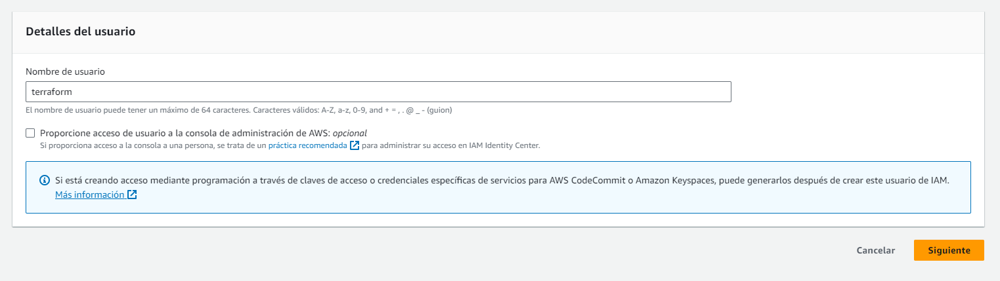
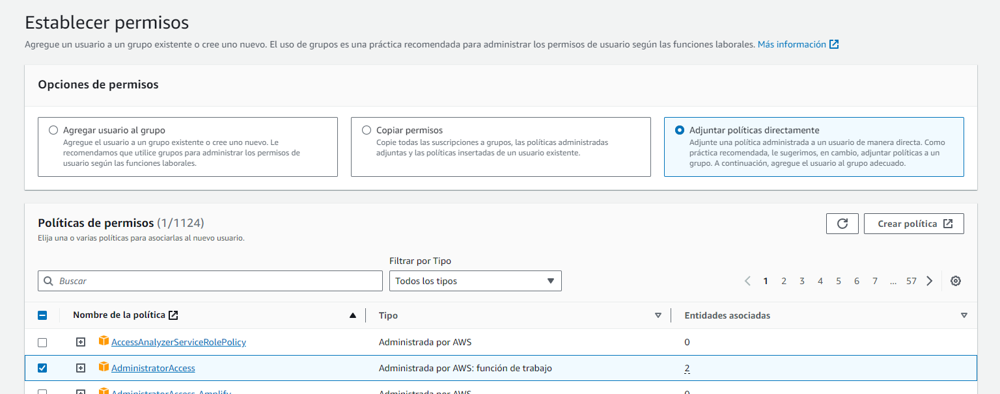
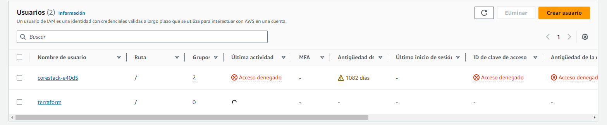
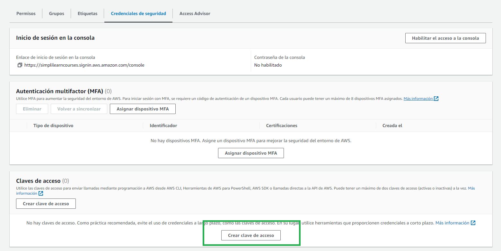

We enter **Secutiry Credentials** and create a new **CLI** set of credentials
<br>
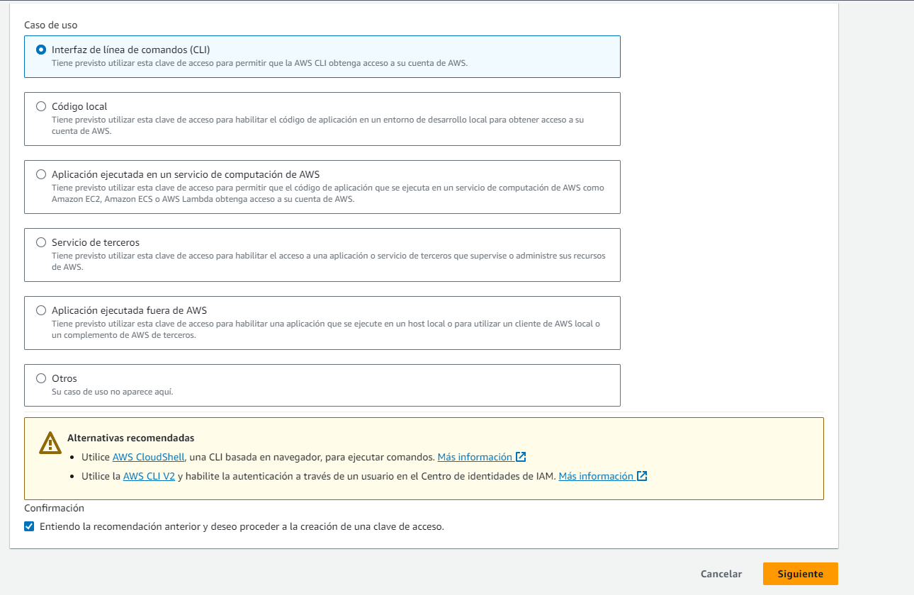

> We write down the **secret key** and **access key** provided

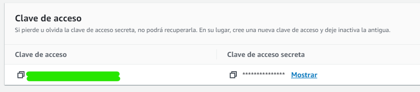

## **2. Install `Terraform`/ Update `Terraform`**
Since we count this scenario as a new set up, we should not have `terraform` installed.

We check terraform instalation status.
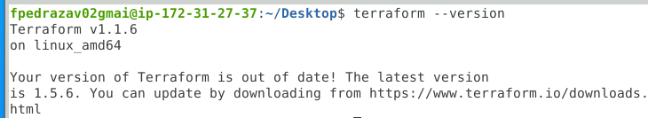

We can use a simple bash script as root to install and update our terraform instalation provided the user has the correct perms in the sudoers file.

```
wget https://releases.hashicorp.com/terraform/1.5.6/terraform_1.5.6_linux_386.zip

unzip terraform_1.5.6_linux_386.zip

mv terraform /usr/local/bin
```

Check installation.

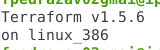

### **3. Gather `AWS` needed data.**

We connect to AWS and gather the next data.
<br>
>**Ami ID:** ami-051f7e7f6c2f40dc1
<br>
>**Region:** N.Virginia
<br>
>**Instance type:** t2.micro
<br>
>**Private Key:** -
<br>
>**Access Key:** -
<br>

### **4. Write ``Terraform``**
Since we have all the data availiable, we can now start coding our ``terraform`` code.

#### 1) Initialize Terraform and download cloud providers dependencies
Prior to crafting a whole script we can add a simple *providers block* to download any cloud provider module needed.

```
provider "aws" {
  region     = "us-east-1"
  access_key = "my-access-key"
  secret_key = "my-secret-key"
}
```
Then we run ```terraform init``` to start and donwload this said modules.
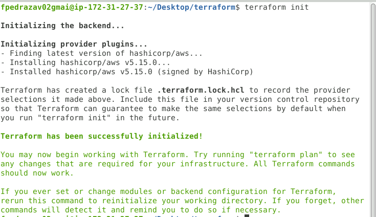

We can then write our security rules as well as inbound and outbound traffic in our code.

```
resource "aws_security_group" "SecurityFwRules" {

    name = "allow_tls"

    description = "Allow TLS inbound traffic"
}

ingress {
    description = "SSH connection from VPC"
    from_port   = 22
    to_port     = 22
    protocol    = "tcp"
    cidr_blocks = ["0.0.0.0/0"]
}

ingress {
    description = "Http connection from VPC"
    from_port   = 8080
    to_port     = 8080
    protocol    = "tcp"
    cidr_blocks = ["0.0.0.0/0"]
}

egress {
    from_port   = 0
    to_port     = 0
    protocol    = "-1"
    cidr_blocks = ["0.0.0.0/0"]
    ipv6_cidr_blocks = ["::/0"]
}
```

With this simple code we are allowing both *ssh* on port 22 to connect to the VM (ingress) and the traffic to the port 8080 via *http*. Which we will use to host Jenkins web portal. 

Also, we allow outbound traffic to any IP via any protocol.


After this we can generate a new key pair.
In the portal, if launch the ``key pairs`` section, and generate one with the next settings.

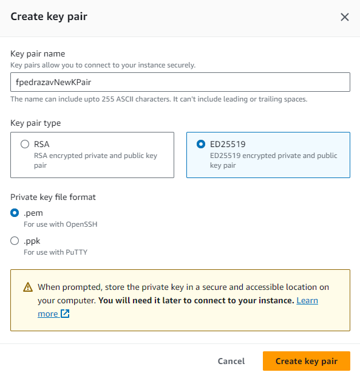

Next, we add the ``aws_instance`` resource block in order to connect the key and what type of intance we want to create.

```
resource "aws_instance" "AWS-TERRA-LAUNCH" {
  ami           = "ami-051f7e7f6c2f40dc1"
  instance_type = "t2.micro"
  tags = {
    Name = "Project1"
  }
   key_name = "fpedrazavNewKPair"
}
```
In this block we can add the tag ``user_data`` which lets us excute commands on the created machine.
We will use this to insert a bash script to install the required dependencies.

```
    user_data = <<-EOF

      #!/bin/bash

        sudo yum install git -y

        sudo amazon-linux-extras install java-openjdk11 -y

  	    sudo wget -O /etc/yum.repos.d/jenkins.repo https://pkg.jenkins.io/redhat-stable/jenkins.repo

        sudo rpm --import https://pkg.jenkins.io/redhat-stable/jenkins.io-2023.key

        sudo yum install jenkins -y

        sudo systemctl start jenkins

        sudo apt install python3

   EOF
```

Finally, with the resource ``aws_network_intergace_sg_attachment`` we match our security group with our instance.

```
resource "aws_network_interface_sg_attachment" "sg_attachment1" {
    security_group_id = aws_security_group.SecurityFwRules.id
    network_interface_id = aws_instance.AWS-TERRA-LAUNCH.primary_network_interface_id
}
```
Once we finish our ``terraform`` main file we can apply it via CLI with ``terraform apply``.

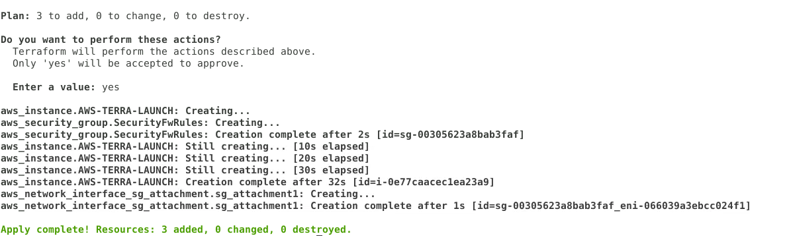

We see how our 3 resources are created as well as the interfaces attached. 

If we check on AWS.

We can see Project1 running.

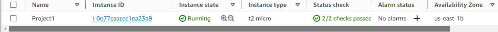

If we take a peek inside to check if everything is installed we can see it has all dependencies

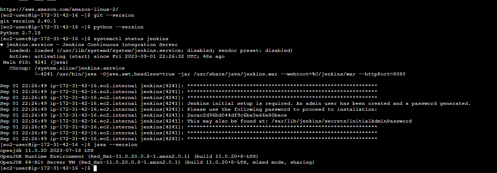

We can also see Jenkins web portal is installed and running in port 8080.

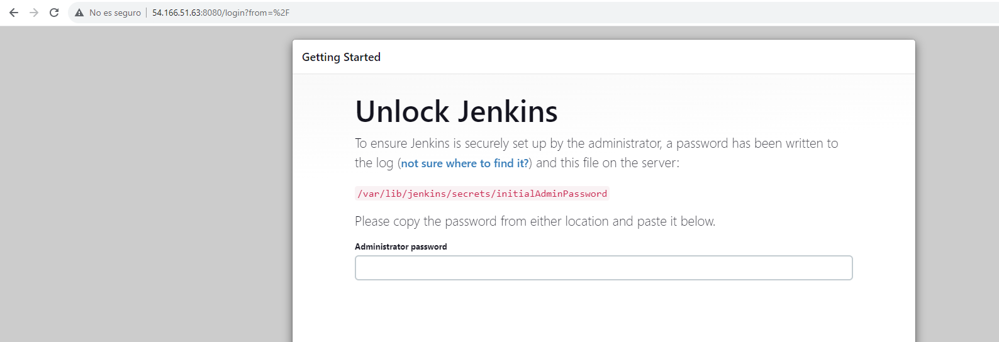

Finally the Instance IP settings are:

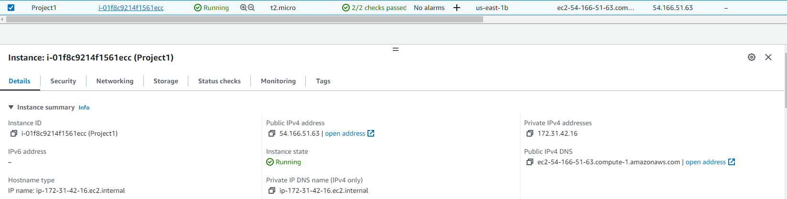

**[Check on GitHub](https://github.com/fpedrazav02/aws-terraform-launch)**